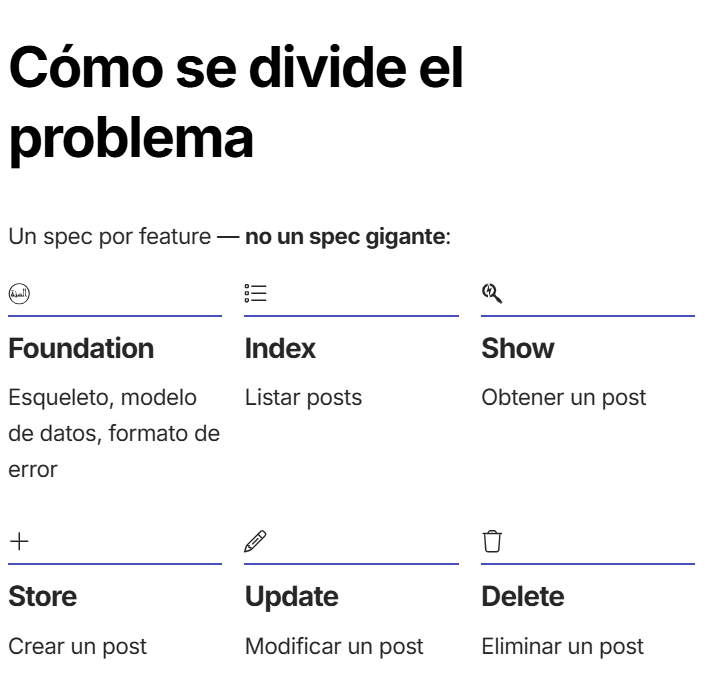
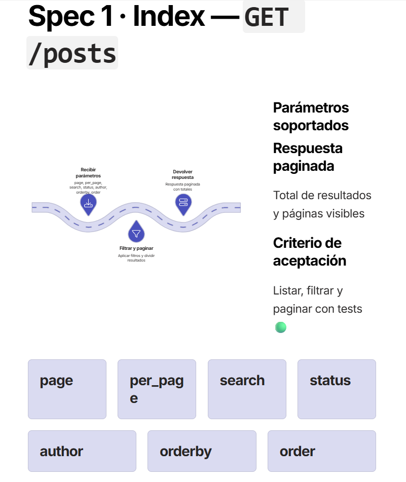
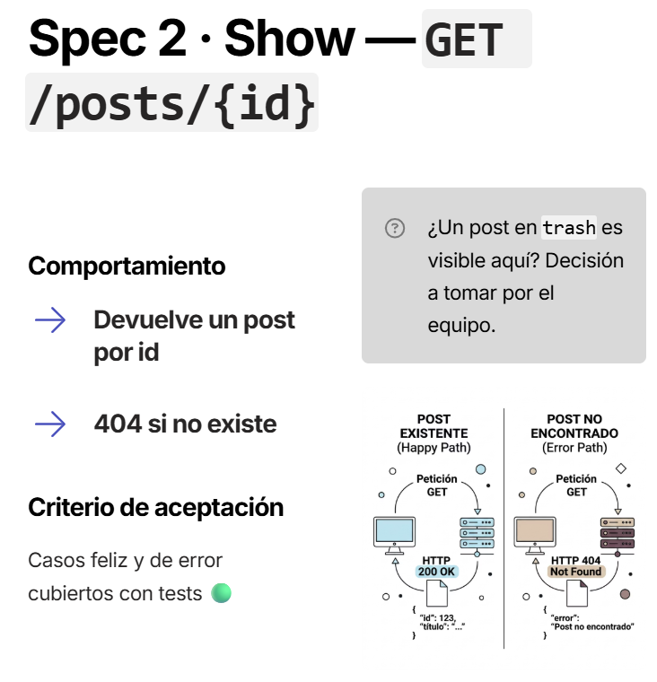
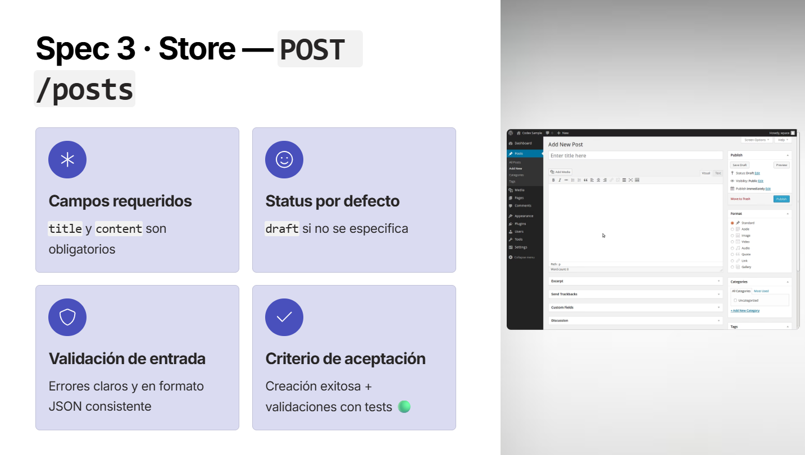
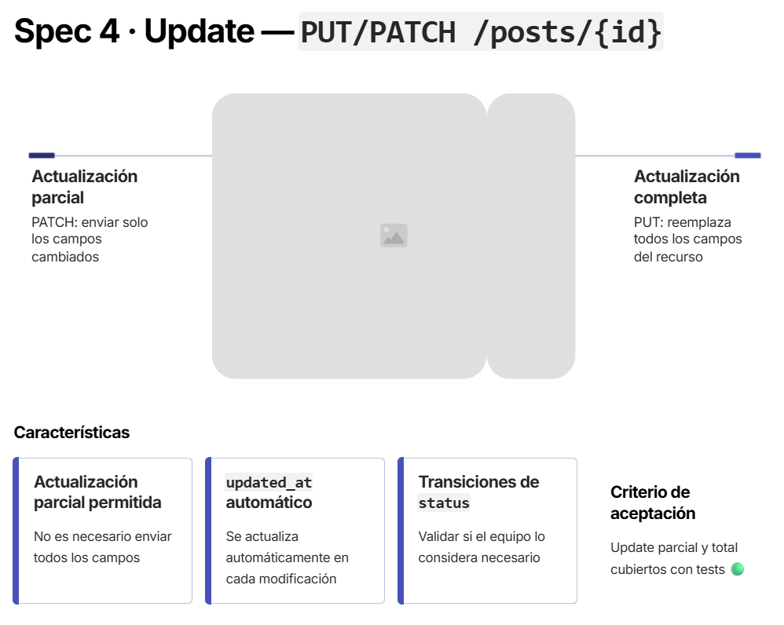
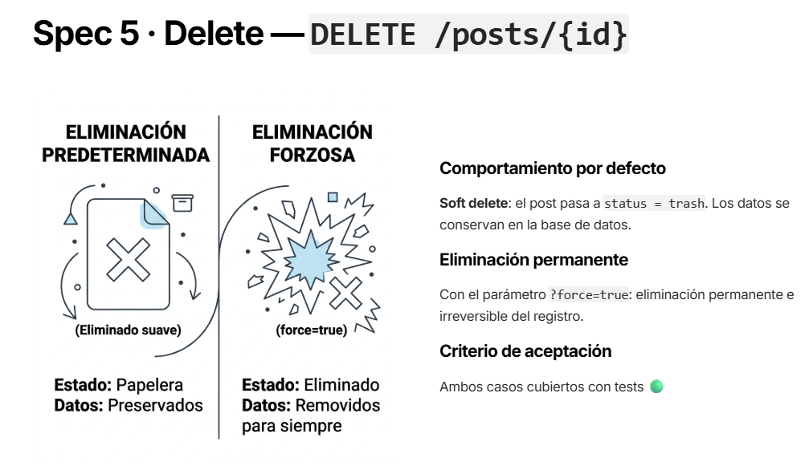
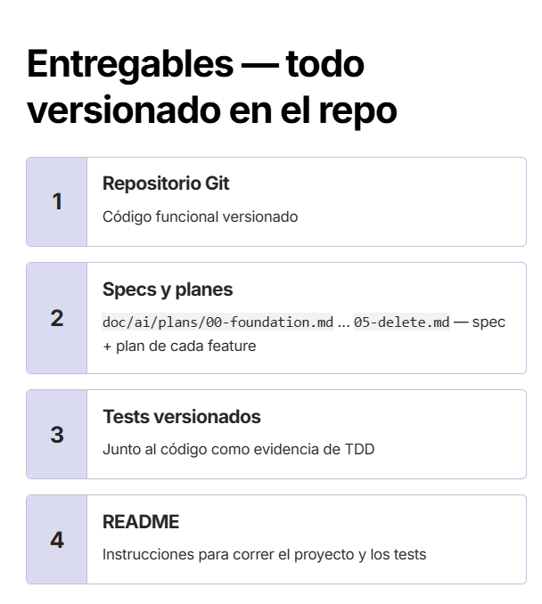
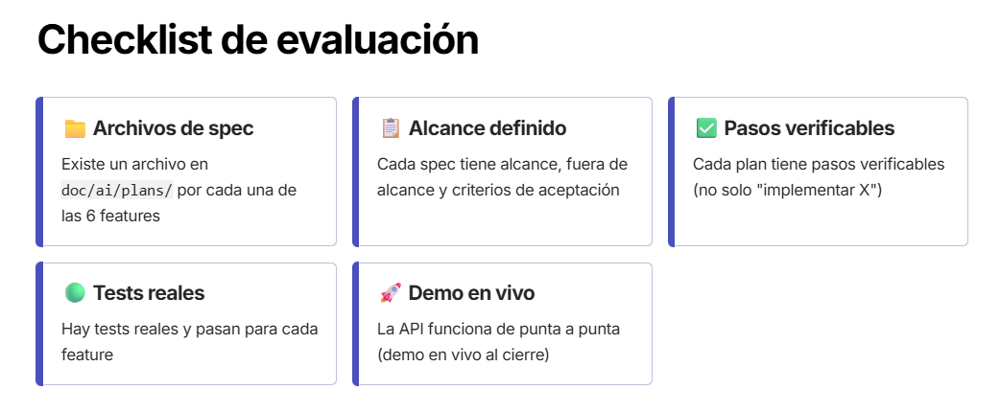

# Contexto de Proyecto: API CRUD para un CMS de posts
## Imagenes

## El problema
- Construir una API CRUD para gestionar publicaciones (posts)
- Inspirada en las reglas mínimas de la REST de WordPress.
- No se necesita implementar WordPress, sólo respetar su contrato básico de recurso.

## Reglas mínimas (inspiradas en WP REST API)

### Recurso POST
- id
- title
- content
- excerpt
- slug
- status
- author_id
- created_at
- updated_at

### Estados válidos
- draft
- publish
- pending
- private
- trash

### Convenciones 

- **Errores consistentes:** formato JSON estándar para todos los errores
- **Páginación:** parámetros `page` y `per_page` en el listado
- **Slud automático:** slug se autogenera si no se envía.

### Flujo de vida de un post
- Solo se puede pasar a `publish` si `title` y `content` no están vacíos.
- Al entrar a `publish` por primera vez, se setea `published_at`.
- Al entrar a `trash`, se setea `deleted_at`; al salir, se limpia
- Un post en `trash` **no acepta** `Update`directo - primero hay que restaurarlo

## Cómo se divide el problema
Un spec por feature - no un spec gigante:
[ ] **Foundation:** esqueleto, modelo de datos, formato de error.
[ ] **Index:** Listar posts.
[ ] **Show:** Obtener un post
[ ] **Store:** Crear un post
[ ] **Update:** Modificar un post
[ ] **Delete:** Eliminar un post
